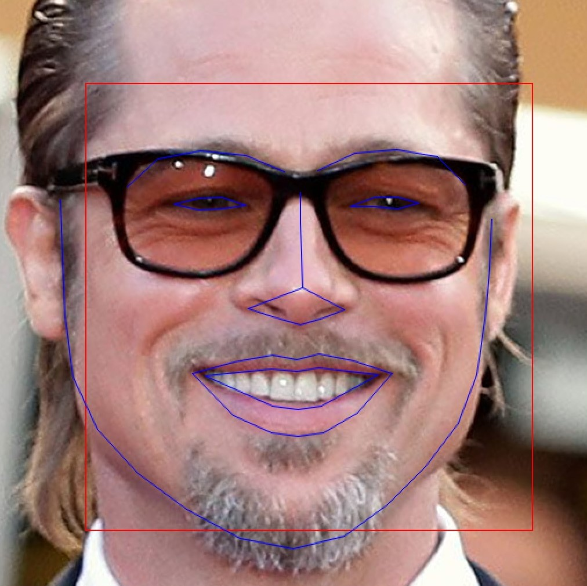
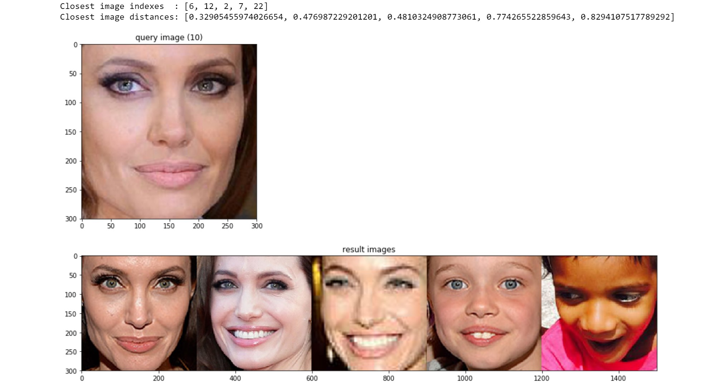
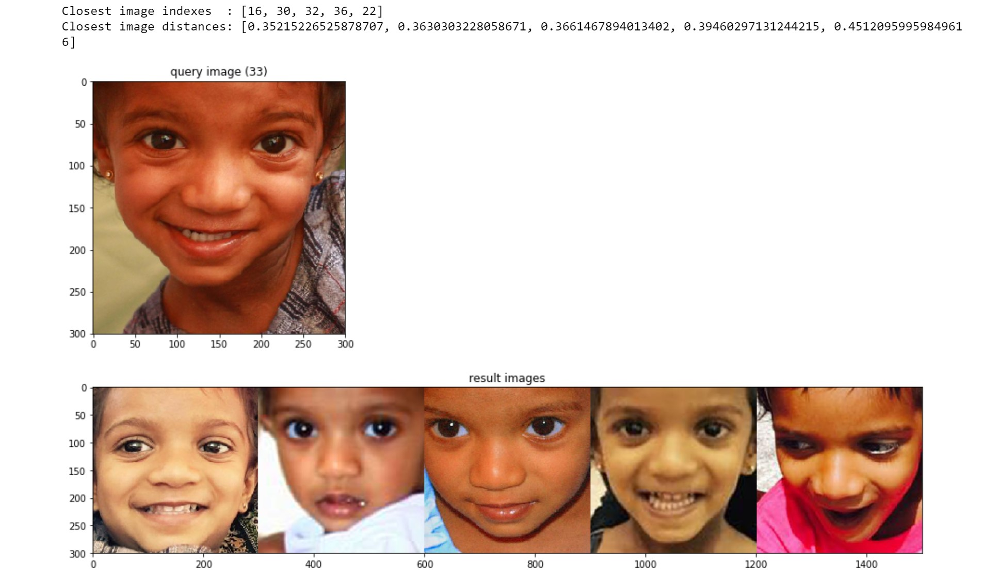
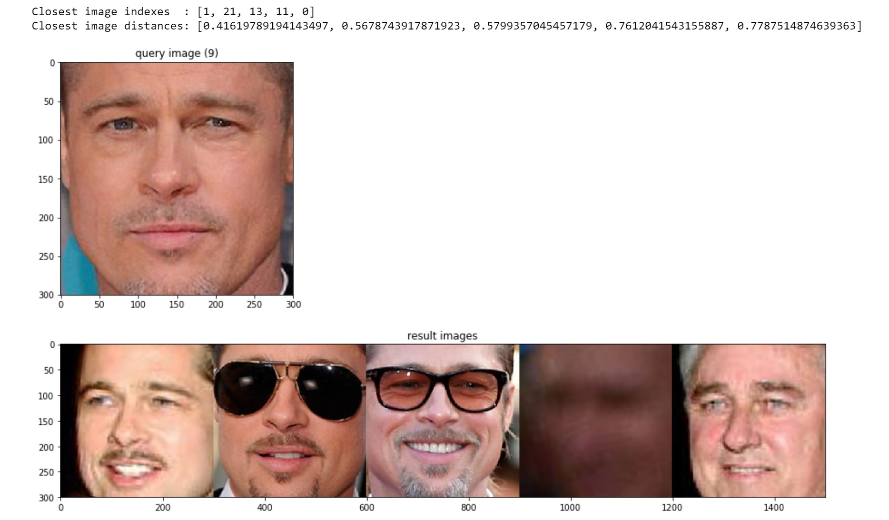

# Face Recognition


Inspired by :
http://dlib.net/face_recognition.py.html

This code uses dlib's face detector model, face landmark calculation model and dlib's face recognition tool. 
  
The face detector model detects the faces in a given image. 

The face landmark calculation model (shape predictor) calcultes 68 face landmarks for each face detected, so we can precisely localize the features (eyes, nose, mouth etc) of the face, and finally feed the landmarks (shape) into the face recognition model.

The face recognition tool maps
an image of a human face to a 128 dimensional vector space where images of
the same person are near to each other and images from different people are
far apart.  Therefore, you can perform face recognition by mapping faces to
the 128D space and then checking if their Euclidean distance is small
enough. 

When using a distance threshold of 0.6, the dlib model obtains an accuracy
of 99.38% on the standard LFW face recognition benchmark, which is
comparable to other state-of-the-art methods for face recognition as of
February 2017. This accuracy means that, when presented with a pair of face
images, the tool will correctly identify if the pair belongs to the same
person or is from different people 99.38% of the time.

With our testings, we found that a distance threshold of 0.58 will help in identifying the difference between siblings.

## Requirements:
```
imutils==0.4.5
numpy==1.13.3
dlib==19.8.1
scikit-image==0.13.1
scikit-learn==0.19.0
scipy==1.0.0
```
## To Run Codes:

### face_landmarks.py
```python face_landmarks.py```

Setting up the path for a new image:

```new_image_path=os.path.join(folder_path, 'maroon_bells.jpg')```

Writes the output into the file: ```faces_json.json```

### Demo jupyter notebook: 

Script : ```Demo.ipynb```

It reads the images from the folder : ```images```


## Face Landmarks:



## Results:

Identified Similar Faces:

### Test 1:



### Test 2:



### Test 3:



## More help from:

[Face Alignment](https://www.pyimagesearch.com/2017/05/22/face-alignment-with-opencv-and-python/)

[Facial_landmarks](https://www.pyimagesearch.com/2017/04/03/facial-landmarks-dlib-opencv-python/)


## Download a trained facial shape predictor and recognition model from: 

Facial shape predictor 5 landmarks: [shape_predictor_5_face_landmarks.dat](http://dlib.net/files/shape_predictor_5_face_landmarks.dat.bz2\n)

Facial shape predictor 68 landmarks: [shape_predictor_68_face_landmarks.dat](https://github.com/AKSHAYUBHAT/TensorFace/tree/master/openface/models/dlib)

Face recognition model:
http://dlib.net/files/dlib_face_recognition_resnet_model_v1.dat.bz2


